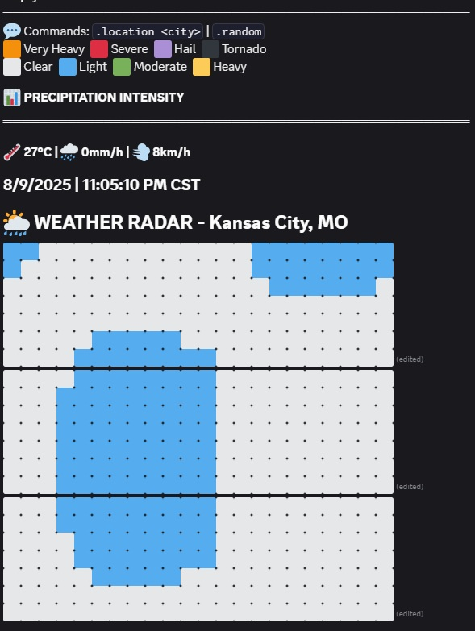

# Discord Weather Radar Bot

A Discord bot that provides real-time animated weather radar displays using actual meteorological data from Open-Meteo API.

## Features

- **Real-time Weather Data**: Fetches current weather conditions from Open-Meteo API
- **Animated Radar Display**: Multi-message animated precipitation radar with emoji-based visualization
- **Global Location Support**: Works with cities worldwide
- **Severe Weather Detection**: Automatically finds locations with active severe weather
- **Interactive Commands**: Change locations, start/stop radar, and get help
- **Temperature & Wind Info**: Displays current temperature, precipitation, and wind speed

## Demo

The bot creates a large animated radar display split across multiple Discord messages, showing:

- Precipitation intensity levels (clear to severe storms)
- Real-time weather conditions
- Temperature, precipitation rate, and wind speed
- Location and timestamp information



## Installation

1. **Clone the repository**:

   ```bash
   git clone <https://github.com/emptier-lab/weather-bot.git>
   cd discord-scripts
   ```

2. **Install dependencies**:

   ```bash
   npm install discord.js-selfbot-v13 axios
   ```

3. **Configuration**:
   Edit `weather.js` and replace the placeholder values:

   ```javascript
   const GROUP_CHAT_ID = "YOUR_GROUP_CHAT_ID_HERE";
   const TOKEN = "YOUR_DISCORD_TOKEN_HERE";
   ```

4. **Run the bot**:
   ```bash
   node weather.js
   ```

## Commands

| Command                | Description                              |
| ---------------------- | ---------------------------------------- |
| `.radar` or `.weather` | Start weather radar display              |
| `.stop`                | Stop radar and clean up messages         |
| `.location <city>`     | Change radar location                    |
| `.random`              | Find random location with active weather |
| `.help`                | Show command help                        |

## Command Examples

```
.location Miami, FL
.location London, UK
.location Tokyo, Japan
.random
.stop
```

## Weather Legend

| Emoji | Condition       |
| ----- | --------------- |
| ⬜    | Clear/Light     |
| 🟦    | Light rain      |
| 🟩    | Moderate rain   |
| 🟨    | Heavy rain      |
| 🟧    | Very heavy rain |
| 🟥    | Severe storm    |
| 🟪    | Hail            |
| ⬛    | Tornado         |

## Configuration Options

You can modify these constants in `weather.js`:

- `ROWS_PER_MESSAGE`: Number of radar rows per Discord message (default: 7)
- `MAP_HEIGHT`: Total height of radar map (default: 21)
- `MAP_WIDTH`: Width of radar map (default: 22)
- `RADAR_SPEED`: Animation speed in milliseconds (default: 300)

## API Information

This bot uses the free [Open-Meteo API](https://open-meteo.com/) for:

- Weather data (temperature, precipitation, wind speed)
- Geocoding (converting city names to coordinates)

No API key required - the service is free for non-commercial use.

## Technical Details

### Architecture

- **RadarDisplay Class**: Manages the multi-message radar display
- **Weather Data Fetching**: Retrieves real-time meteorological data
- **Pattern Generation**: Creates realistic radar patterns based on actual weather
- **Animation System**: Updates radar display with smooth transitions

### Discord Limitations

- Each message limited to ~2000 characters
- Radar split across multiple messages for larger display
- Rate limiting handled with delays between message edits

## Supported Locations

The bot includes pre-configured coordinates for major cities worldwide and can also resolve any location name through the geocoding API.

## Error Handling

- Automatic retry for failed API requests
- Graceful handling of deleted messages
- Rate limit compliance for Discord API
- Fallback locations if weather data unavailable

## Contributing

1. Fork the repository
2. Create a feature branch
3. Make your changes
4. Test thoroughly
5. Submit a pull request

## Disclaimer

**Important**: This bot uses discord.js-selfbot-v13, which automates user accounts. Using self-bots may violate Discord's Terms of Service. This project is for educational purposes only. Use at your own risk.

## Support

If you encounter issues:

1. Check that your Discord token and group chat ID are correctly configured
2. Verify internet connectivity for API access
3. Ensure the bot has necessary permissions in the target channel
4. Check console logs for error messages

## Credits

- **Created by**: empty?
- Weather data provided by [Open-Meteo](https://open-meteo.com/)
- Built with [discord.js-selfbot-v13](https://github.com/aiko-chan-ai/discord.js-selfbot-v13)
- Emoji-based radar visualization inspired by meteorological radar displays
